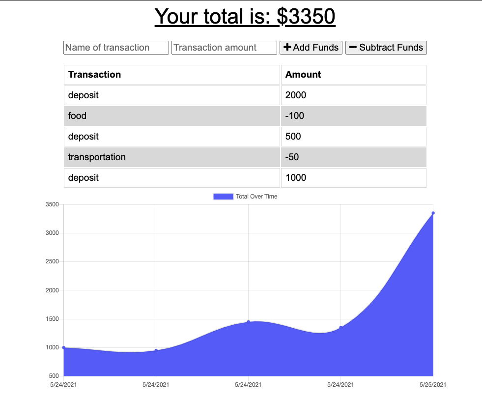
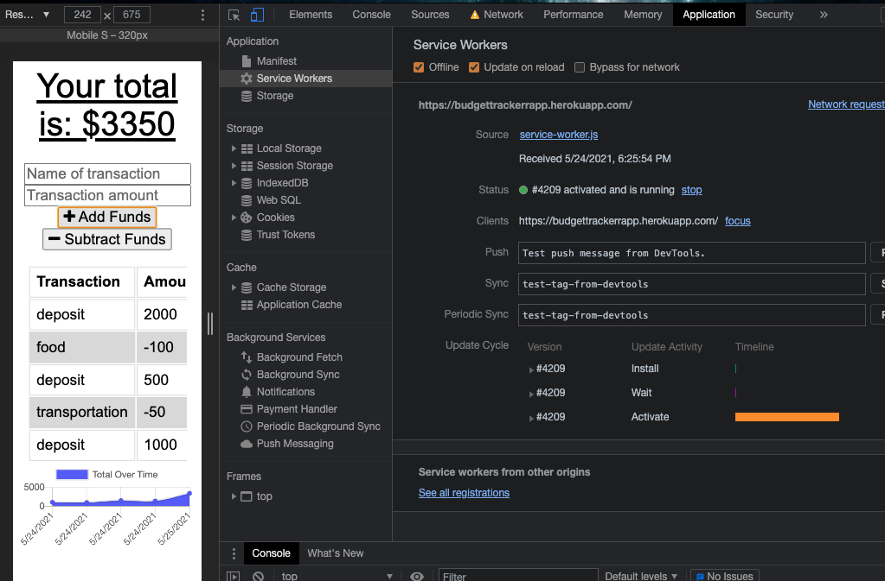

# BudgetTracker

## License

## Description
Add functionality to our existing Budget Tracker application to allow for offline access and functionality.

The user will be able to add expenses and deposits to their budget with or without a connection. When entering transactions offline, they should populate the total when brought back online.

## Technologies Used

* Express
* NoSql - MongoDB
* Mongoose

## User Story
AS AN avid traveller
I WANT to be able to track my withdrawals and deposits with or without a data/internet connection
SO THAT my account balance is accurate when I am traveling

## Business Context

Giving users a fast and easy way to track their money is important, but allowing them to access that information anytime is even more important. Having offline functionality is paramount to our applications success.

## Acceptance Criteria
GIVEN a user is on Budget App without an internet connection
WHEN the user inputs a withdrawal or deposit
THEN that will be shown on the page, and added to their transaction history when their connection is back online.

## Screenshots

When the user loads the page, the user will be able to add expenses and deposits to their budget with or without a connection. When entering transactions offline, they should populate the total when brought back online.

The user can enter deposits/expenses offline.

When brought back online entries are added to the tracker.

## Demo

Deployed Heroku application: https://.budgettrackerrapp.herokuapp.com

## Contact

You can follow my repositories at https://www.github.com/srad25
